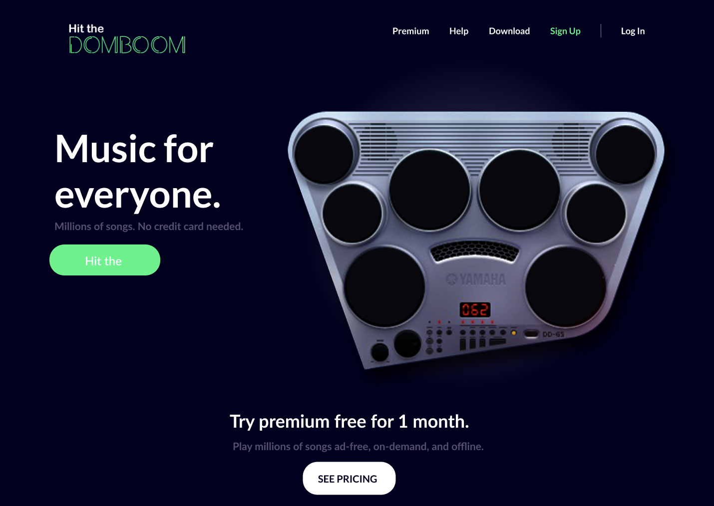

# Hit the DOMboom🥁
A client has requested the development of a landing page for his musical instrument company, he plans to sell a battery that is his flagship product.

# Tecnologies
<ul>
  <li> </a> <a href="https://www.w3schools.com/css/" target="_blank" rel="noreferrer"></li>
  <li>CSS</li>
  <li>JavaScript</li>
</ul>

# Tools
 </a>  

# GOAL
The objective is to make a replica of the landing page based on the design proposed by the client with the priority that the user can interact with the drum kit in such a way that when the user clicks on each of the pads it is emitted a sound.

It has to be functional on any device and adapt to it.

# This is how the landing page looks like:
### Desktop:

